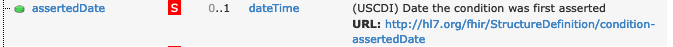

# Background

This guide walks developers through the process of creating tests for new
versions of the US Core Implementation Guide.  While this test kit provides
tools to support the creation of these tests based on machine-readable content
published within the US Core Implementation Guide, not all aspects can be 100%
automated.  This document describes the overall process required to use the
automated tools, and typical manual steps needed to address changes that cannot
be automated.

Prior to reviewing this document, the developer is expected to be familiar with
using the US Core Test Kit and building test kits using the Inferno Framework.
Please review the [Technical Overview](Technical-Overview) document for a
high-level overview of the test kit's design.

This document should be updated after each new version of the US Core
Implementation guide is incorporated into the Test Kit.

# Versions of US Core Test Kit to Support

This test kit should be updated to provide testing for all versions of the US
Core Implementation Guide that is approved for certification within the
ONC Certification Program (g)(10) Standardized API Certification Criterion.

There is also value to providing tests for versions not approved for certification
under this ONC Certification Program criterion, as US Core has a broader
scope than that criterion.  This test kit includes tests for several versions
of US Core that are not approved for certification to this criterion.

It is also beneficial to create tests for balloted versions of the
implementation guide to help the implementation guide authors identify any
problems that exist within the IG prior to official publication.  The
test generator uses almost all machine-readable content provided by the IG, and
is therefore a useful tool for identifying any problems that may exist.  It is
best if these issues are identified during ballot versions because once a final
version is published, it becomes substantially harder to change, particularly if
it becomes referenced in regulation.

All steps below can apply to either a ballot version of an IG, or an official
release.  A general convention that this test kit has taken is to name suites
that refer to a ballot using "-ballot" appended to the end of the suite ID.  Once
the final version is released, the ballot version is deleted.

# How to Update the Test Kit

Tests for a new version of the US Core Implementation Guide can be created
for this Test Kit using the following steps:

1. Perform a structured review of the updates to the IG
2. Generate a new version-specific suite
4. Validate tests against a reference server that includes complete example data
5. Iterate based on feedback from implementers

Each of these steps is described below.

## Step 1. Perform a structured review of the updates to the IG

This test kit provides a test generator that can automatically extract
requirements from the CapabilityStatements, SearchParameters, and
StructureDefinitions to create tests. However, not all requirements are provided
in a structured form that can be used by the test generator. A complete review
of the updates is first necessary to understand the scope of changes across
the Implementation guide.

This involves a detailed comparison against the requirements, especially
requirements in narratives, of the previous version. As part of this comparison,
identify and document all modifications, additions, revisions, or removals.
Such understanding is crucial for accurately incorporating these updates into
the relevant workflow or system. The result of comparison should be saved in a
US Core Requirement Comparison table or chart for later reference.

US Core provides a summary of changes with each version of an Implementation
Guide, which is a good starting point for this activity.

## Step 2. Generate a New Version-specific Suite

This Test Kit is organized into several version-specific test suites.  For example,
there is a US Core v3.1.1 test suite, and a US Core v4.0.0 test suite.  In order to
support a new version of US Core, the test developer will create a new test suite
by using the generator script that is provided a the US Core IG as a versioned packaged.

### Step 2.1 Download the US Core Implementation Guide package

* Navigate to the US Core Implementation Guide Download page at <https://hl7.org/fhir/us/core/downloads.html>.
* Identify and select the Implementation Guide version that aligns with your
  project requirements.
* Proceed to download the “Package File” (package.tgz).
* Move the downloaded package.tgz file into the “./lib/us_core_test_kit/igs”
  directory of the US Core Test kit repository on your local system.
* For clarity and version control, rename package.tgz to reflect the version it
  represents, e.g., “us_core_610.tgz”.
* It's important to note that the US Core Implementation Guide may necessitate
  additional artifacts from the FHIR Core Specification that are not
  automatically included. These must be integrated manually if required.

### Step 2.2 Integrate Additional Implementation Guide Artifacts

While the Implementation Guide (IG) package is designed to be comprehensive,
there are instances where certain artifacts, such as SearchParameters,
ValueSets, or CodeSystems, might not be included within the package itself. An
example of this is the “condition-assertedDate” extension within the US Core v6.1.0
Condition profile.

</s>

This particular extension, while not packaged within the US Core v6.1.0
Implementation Guide, can be found within the FHIR Extension Pack. Such
extensions must be downloaded manually from the FHIR Extensions Pack
(https://hl7.org/fhir/extensions/) and stored in the “ig” folder.

Identifying these external artifacts can be challenging. The meticulous
preparation outlined in step 1 can aid in pinpointing some of these
artifacts. However, others may come to light during the test suite generation
and review phases.

To add additional artifacts to the US Core Test Kit:

* Inside the `./lib/us_core_test_kit/igs` directory, generate a sub-folder that
  bears the same name as the downloaded tgz file; for example, if the
  Implementation Guide file is named `us_core_610.tgz`, then the corresponding
  folder should be labeled `us_core_610`.
* Locate the additional artifacts. Extensions can be found in the FHIR
  Extensions Pack (<https://hl7.org/fhir/extensions/>). Profiles and Search
  Parameters can be found in corresponding Implementation Guide or FHIR
  Specification R4.0.1 (<https://hl7.org/fhir/r4/>). Value Sets and Code Systems
  can be found in either HL7 Terminology (THO) (<https://terminology.hl7.org/>)
  or VSAC (https://vsac.nlm.nih.gov/)
* Download the additional artifacts to the folder created in the first bullet
  point. This step ensures that all necessary components are included for a
  comprehensive test environment.

### Step 2.3 Incorporate Version-Specific Custom Groups

The creation of custom groups is essential for a comprehensive test suite, as
not all tests can be generated directly from the machine-readable content within
the IG. The Custom Groups folder includes tests that derive from the US Core
Guidance section rather than the Profile section. Examples of such tests include
those for Clinical Notes and SMART scopes, which apply across all profiles. This
approach ensures coverage of specific requirements not directly linked to
profile validations. 

For example, in v6.1.0, the following custom groups are included:
* `capability_statement_group.rb`: Provides custom validations of the capability
  statement that are relevant to this specific version of the implementation guide.
* `screening_assessment_group.rb`: Provides custom validation of Screening Assessments
  as defined in guidance in the implementation guide.
* `smart_granular_scopes.rb`: Provides additional tests for authorization servers supporting
  SMART App Launch as required in this version of the implementation guide.

#### Create a Version-Specific Folder

Establish a folder named after the specific version of the US Core being
implemented, such as “v6.1.0”. The folder name should precisely mirror the
version number of the Implementation Guide (IG) for clarity and organization.

#### Add the `capability_statement_group.rb` File

This file should be duplicated from an existing version. It contains the
“PROFILE” constant, which maps FHIR resource types to their corresponding US
Core profiles. This mapping can range from one-to-one relationships (e.g.,
Patient) to one-to-many (e.g., Observation). It is crucial to update this object
to reflect the nuances of the specific US Core IG version in question.

#### Incorporate the `smart_granular_scopes_group.rb` File

Like the capability\_statement\_group.rb, this file can also be copied from an
existing version. The Smart Granular Scopes tests, introduced in US Core v6.1.0,
require adjustments tailored to the particular US Core version being tested to
ensure relevance and accuracy.

#### Develop Custom Tests for US Core Guidance

The US Core Guidance chapter may set forth additional requirements that requests
the creation of custom tests within this group. Examples include guidance on
Data Absent Reason and Clinical Notes. Whenever new guidance emerges, it's
important to create a specialized test or tests in this section to ensure
comprehensive coverage of all US Core stipulations.

### Step 2.4 Manage Special Cases

In the development of the US Core Test Suite, handling special cases is a
necessity. To streamline this process, all special handling instructions are
consolidated within the `,/lib/us_core/generator/special_cases.rb` file. Below
is an overview of the key constants defined in this file and their significance:

#### RESOURCES_TO_EXCLUDE

This constant lists the resource types that are excluded based on two criteria:

* The resource type does not correspond to any USCDI data class or data element.
* The resource is not referenced by a MustSupport element in any other US Core profile.

If a resource type meets both conditions, it should be added to this list. The
test generator will not create tests for these excluded resource types.

Inclusion in this list can be version-specific, indicating that while certain
versions may exclude a resource type, future versions might not. For instance,
'PractitionerRole' => ['v311', 'v400'] indicates that PractitionerRole is
excluded in US Core versions 3.1.1 and 4.0.0, but included in versions 5.0.1 and
6.1.0.

#### PROFILES_TO_EXCLUDE

This constant identifies "abstract" profiles, which serve as the basis for one
or more "concrete" profiles. Two profiles are listed here:

* US Core Vital Signs profile
* US Core Survey profile

Both profiles do not have their own test groups in the test suite. Instead,
specific tests are created for each concrete implementation of these abstract
profiles. It's crucial to recognize that not all parent profiles are treated as
abstract; for example, both US Core Lab Result and US Core Clinical Result
profiles have their test groups in version 6.1.0.

#### OPTIONAL_RESOURCES and OPTIONAL_PROFILES

These constants enumerate the resource types and profiles that are optional
within the US Core framework. They are either optionally mapped to a USCDI
element or referenced by another US Core profile. The test suite treats these as
optional test groups, and if a server supports any of these, it must pass all
associated tests. Examples include the US Core PractitionerRole, US Core
QuestionnaireResponse, and US Core Simple Observation profiles, each with
specific conditions under which they are considered optional.

#### NON_USCDI_RESOURCES

This list includes US Core resources that, while not directly aligned with a
USCDI data class or element, are referenced by MustSupport elements in other US
Core profiles. This differentiation is version-specific and reflects the
evolving relationship between US Core and USCDI standards. For instance, the
Encounter resource was not part of USCDI v1 but was included in USCDI v2.

#### SEARCHABLE_DELAYED_RESOURCES

Delayed resources are those not immediately searchable due to their presence in
the NON\_USCDI\_RESOURCES list or lack of a mandatory patient search parameter.
The test suite gathers instances of these resources through references in other
US Core resources and typically excludes them from search tests, with certain
exceptions. An example is the US Core Location resource, which, in USCDI v4,
becomes a searchable element despite being a delayed resource.

#### ALL_VERSION_CATEGORY_FIRST_PROFILES and VERSION_SPECIFIC_CATEGORY_FIRST_PROFILES

Beyond the general approach of initiating test groups with patient search
parameter tests, exceptions exist that start with both patient and category
search parameters. This strategy is mainly applied to Observation profiles to
facilitate more precise and relevant search results. The first list encompasses
profiles applicable across all US Core versions, while the second list is
tailored to specific version requirements, ensuring the test suite's
adaptability to the evolving landscape of US Core specifications.

### Step 2.5: Implement Version-Specific MustSupport Metadata Extraction

The US Core Implementation Guide (IG) delineates three categories of MustSupport
components: elements, extensions, and slicing. The majority of these components,
which have the attribute “mustSupport: true” within the profile’s
StructureDefinition, are automatically identified and extracted by the test
generator. However, there are specific scenarios that require additional manual
effort:

#### Incorporating MustSupport for "Additional USCDI" Elements

US Core Profiles are designed to align with the requirements of the U.S. Core
Data for Interoperability (USCDI), particularly for the ONC Health IT
Certification under criterion g(10). However, not all elements necessary for
representing USCDI Data Elements are marked as Mandatory or MustSupport within
the StructureDefinition, mainly because such designations may not be requisite
for the broader spectrum of implementers outside of those seeking certification.

From version 4.0.0 onwards, the US Core profile documentation introduced an
"Additional USCDI Requirement" section, listing those components required by
USCDI but not explicitly tagged as MustSupport in their StructureDefinition.

By version 6.1.0, US Core IG applied the uscdi-requirement extension within
StructureDefinitions covering both MustSupport components and additional USCDI
requirements. This requires a calculation to differentiate the actual
"additional" USCDI requirements by subtracting the MustSupport components from
those tagged as USCDI requirements.

With the release of US Core v7.0.0, the uscdi-requirement extension was refined
to only apply to these "additional" USCDI requirements, removing it from
components already identified as MustSupport.

The US Core Test Generator can automatically extract both MustSupport and
USCDI-Requirement information directly from the StructureDefinitions. However,
certain cases, such as the representation of Patient.deceasedDateTime as a USCDI
data element within the US Core Patient profile, may require manual adjustments
due to technical constraints.

#### Addressing MustSupport Choices

The "Profile Specific Implementation Guidance" provided for each US Core profile
may introduce additional rules, offering server systems choices in how they
support MustSupport elements. An example of this is the US Core v6.1.0
DocumentReference profile, which offers Implementation Guidance as:

> “The DocumentReference resources can represent the referenced content using
either an address where the document can be retrieved using
DocumentReference.attachment.url or the content as inline base64 encoded data
using DocumentReference.attachment.data.”

> Although both are marked as Must Support, the server system is not required to
support an address and inline base64 encoded data, but SHALL support at least
one of these elements.

Handling these "Must Support Choices" requires a tailored approach, implemented
through the `add_must_support_choices` method. This method manually
integrates the flexibility allowed by the IG, ensuring that the test suite
accurately reflects the range of implementation options available to server
systems.

### Step 2.6: Run the Generator

Once all the preliminary tasks have been completed, initiate the test generation
by using the following command from the root of project directory:

`bundle exec rake us_core:generate`

The generated tests will be stored in the following directory:
"./lib/us\_core\_test\_kit/generated/[us\_core\_version]"

You should also be able to run the unit tests using

`bundle exec rake`

If there are any errors surfaced during this process, use the feedback provided
by the rspec tests to correct the errors in the tests.  This may involve updating
the generator.

### Step 3: Validate tests against a reference server that includes complete example data

Once the tests are successfully generated and passing the unit tests, they should now
be run against a known good implementation.  The inferno team uses the Inferno Reference
Server for this.  Prior to running the tests, additional example data should be used on the
reference server.

### Update Validation Message Filter

During testing, there could be validation errors which are caused by underlying
issues in the Implementation Guide, validator, or terminology services rather
than the tests themselves. In this case, the error messages should be excluded.
A reference to the approved FHIR JIRA ticket that notes the underlying issue
should be included to indicate the reason for a message filter.

After such decision has been made, the changes should be applied to
VALIDATION\_MESSAGE\_FILTERS constant in the
`./lib/us_core_test_kit/generator/templates/suite.rb.erb` file.

## Step 5. Iterate based on feedback from implementers

It is very challenging to create tests that are completely correct without
validating them against real implementer systems.  Since these tests are typically
implemented prior to the availability of any other systems to test against, the initial
release of the tests may contain issues.  Test developers should expect that
issues will arise as real systems use these tests, and plan to make successive updates
to them to address them as soon as possible.